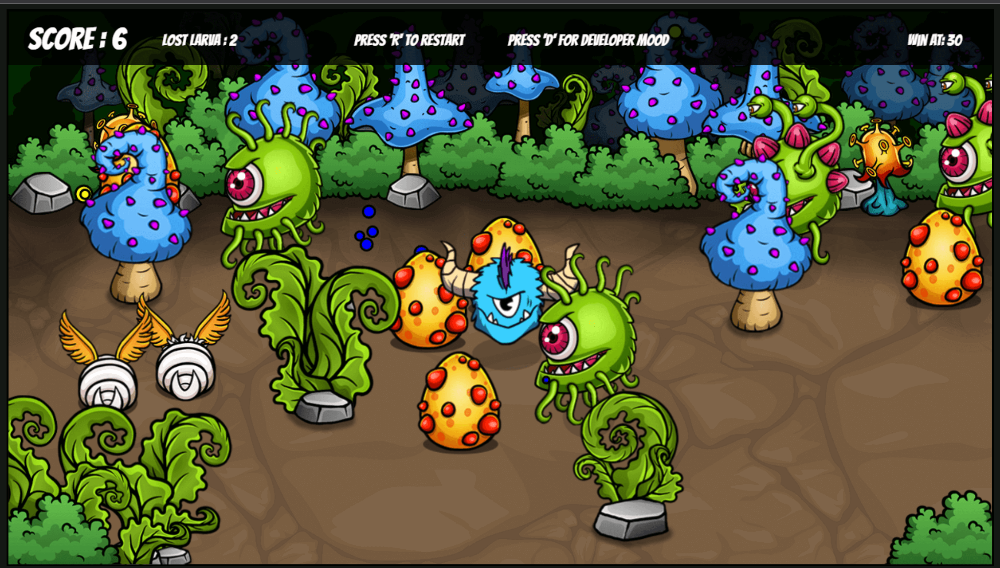
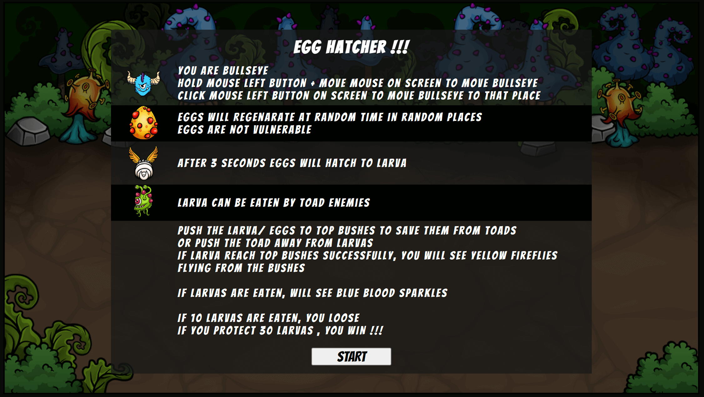

# [Egg hatcher --by 'Md Antor'](https://egg-protector-by-antor.netlify.app/) 
## is an Web based game where you save hatched larva from Toad Enemies

### [Live link : https://egg-protector-by-antor.netlify.app/](https://egg-protector-by-antor.netlify.app/)

## Technologies used
* HTML
* CSS
* JavaScript

## Technical Abilities
* Responsive to differnt Screen ratio.
* On all devices play on 70 FPS, so look and feels same everywhere.
* optimized for better performence and usability.
* Adjust width and Height According to the display size.
* keep aspect ratio and don't work on portrait mood.
* Loading state so, game after loading can be played properly.
* Class and Class extends are used to reduce unnecessary code and extend reusability.
* Restart game on Keyboard "R" button
* See underlying functionality by pressing keyboard "D" button

## Art and design
* Collected from 3rd party, distributed free to learning usages.

## Idea and theme
* Sea tortoise hatch eggs on bitch and after hatched, when going to sea, they are eaten by birds.

* so, you be the savior.

 
 
 
 

### [Github link of Owner: https://github.com/Antor1155](https://github.com/Antor1155)
### [LinkedIn link: https://www.linkedin.com/in/md-antor/](https://www.linkedin.com/in/md-antor/)